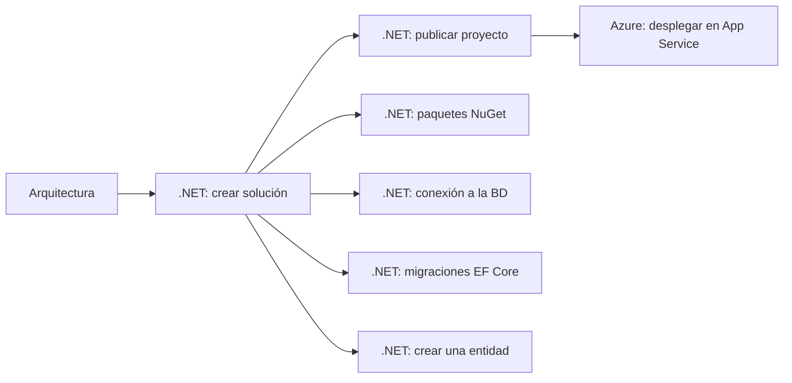

# 📘 Guía de Microservicios con .NET

Documentación de referencia para el diseño, construcción y despliegue de microservicios en **.NET** siguiendo **Clean Architecture**, con ejemplos de comandos de **.NET CLI**, **Entity Framework Core** y despliegue en **Azure App Service**.

Este material está pensado como una guía de estudio y consulta rápida, tanto para desarrolladores que están empezando con microservicios en .NET como para quienes ya tienen experiencia y necesitan un recordatorio rápido de comandos y buenas prácticas.

---

## 📂 Índice

### 🏛️ Arquitectura
- [Introducción a la arquitectura](docs/arquitectura/README.md)
- [Microservicios](docs/arquitectura/microservicios.md)
- [Clean Architecture y arquitectura por capas](docs/arquitectura/clean-architecture.md)
- [Estructura de carpetas por capa](docs/arquitectura/estructura-carpetas.md)

### ⚙️ .NET
- [Introducción](docs/dotnet/README.md)
- [Crear una solución de microservicios](docs/dotnet/crear-solucion-microservicios.md)
- [Gestión de paquetes NuGet](docs/dotnet/paquetes-nuget.md)
- [Crear conexión de microservicio a su base de datos](docs/dotnet/crear-conexion-bd.md)
- [Entity Framework Core: migraciones](docs/dotnet/entity-framework-migraciones.md)
- [Crear una entidad (ejemplo Persona)](docs/dotnet/crear-entidad.md)
- [Publicar un microservicio](docs/dotnet/publicar-proyecto.md)

### ☁️ Azure
- [Introducción](docs/azure/README.md)
- [Despliegue en Azure App Service](docs/azure/app-service-deployment.md)

---

## 🧭 ¿Por dónde empezar?

1. Comprende primero los **principios de Clean Architecture** y cómo se distribuyen las responsabilidades entre capas.
2. Aprende a **crear la solución y los proyectos** de cada microservicio con `dotnet CLI`.
3. Configura las **dependencias (NuGet)** necesarias por capa.
4. Configura la **conexión a la BD**.
5. Trabaja con **Entity Framework Core** para generar y aplicar migraciones.
6. Construye tu **primer entidad** completo (entidad, configuración, repositorio).
7. **Publica y despliega** el microservicio en Azure App Service.

> **Nota**
> Esta documentación se basa en notas de aprendizaje personal, reorganizadas y ampliadas con buenas prácticas actuales de .NET y Azure. Donde se detectó información incompleta, se agregó contexto adicional indicándolo explícitamente.
