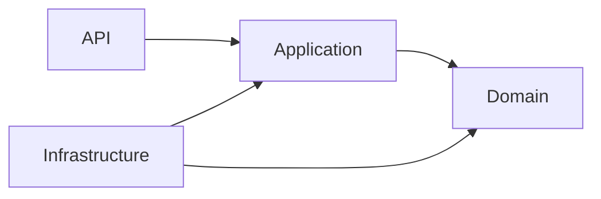
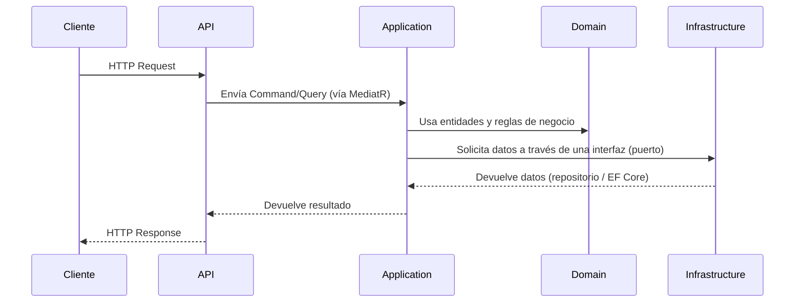

# Clean Architecture (Arquitectura por Capas)

## Tabla de contenido
- [¿Qué es?](#qué-es)
- [¿Para qué sirve?](#para-qué-sirve)
- [¿Cuándo utilizarla?](#cuándo-utilizarla)
- [Regla principal de dependencias](#regla-principal-de-dependencias)
- [Responsabilidad de cada capa](#responsabilidad-de-cada-capa)
- [Ventajas](#ventajas)
- [Desventajas](#desventajas)
- [Flujo de funcionamiento](#flujo-de-funcionamiento)
- [Buenas prácticas](#buenas-prácticas)
- [Errores comunes](#errores-comunes)
- [Recursos relacionados](#recursos-relacionados)

## ¿Qué es?

**Clean Architecture** es un patrón de diseño de software propuesto por Robert C. Martin ("Uncle Bob") que organiza el código en **capas concéntricas**, donde las reglas de negocio (el dominio) se ubican en el centro y quedan completamente aisladas de detalles técnicos como bases de datos, frameworks web o servicios externos.

En un proyecto .NET, esto se traduce normalmente en **cuatro proyectos separados** dentro de la solución: `API`, `Application`, `Domain` e `Infrastructure`.

## ¿Para qué sirve?

- Aísla la lógica de negocio de detalles de infraestructura (bases de datos, frameworks, librerías externas).
- Permite cambiar de tecnología (por ejemplo, de SQL Server a PostgreSQL, o de EF Core a Dapper) sin tocar las reglas de negocio.
- Facilita las pruebas unitarias, ya que el dominio y los casos de uso no dependen de infraestructura real.
- Mejora la mantenibilidad a largo plazo en proyectos que crecen en complejidad, como sistemas de microservicios.

## ¿Cuándo utilizarla?

Es recomendable en:
- Proyectos con reglas de negocio complejas o que evolucionan con frecuencia.
- Sistemas que se espera mantener y escalar durante varios años.
- Arquitecturas de microservicios, donde cada servicio debe ser independiente y testeable.

No es estrictamente necesaria en:
- Prototipos rápidos o pruebas de concepto (POCs) de corta duración.
- Microservicios extremadamente simples (por ejemplo, un único endpoint CRUD) donde la sobreingeniería puede ralentizar el desarrollo.

## Regla principal de dependencias

> **Regla de oro:** las dependencias **solo apuntan hacia adentro**. Ninguna capa interna debe conocer a una capa externa.

| Capa | Conoce a | No conoce a |
|---|---|---|
| **Domain** | A nadie | API, Application, Infrastructure |
| **Application** | Domain | API, Infrastructure |
| **Infrastructure** | Application y Domain | API |
| **API** | Application (y opcionalmente Infrastructure, solo para registrar dependencias) | Domain directamente |

## Responsabilidad de cada capa

### API
- Referencia a `Application`.
- Contiene los `Controllers`, `DTOs` de entrada/salida HTTP y el `Program.cs` (punto de entrada de la aplicación).
- Es la capa "más externa": expone el microservicio al mundo exterior (HTTP, gRPC, etc.).
- No debe contener lógica de negocio.

### Application
- Referencia a `Domain`.
- Contiene los servicios de aplicación, casos de uso (commands/queries) e interfaces (como por ejemplo, `IRepository`) que serán implementadas en `Infrastructure`.
- Orquesta la lógica de negocio, pero no la implementa directamente: delega en el `Domain`.
-No conoce detalles de implementación como bases de datos, EF Core o servicios externos.

### Domain
- No referencia a ninguna otra capa.
- Contiene las **entidades**, **objetos de valor (Value Objects)**.
- Es el corazón de la aplicación: aquí vive la lógica de negocio pura, sin dependencias externas.
- Debe poder evolucionar sin depender de la infraestructura utilizada.

### Infrastructure
- Referencia a `Domain` y, opcionalmente, a `Application`.
- Contiene los repositorios, el `DbContext` de EF Core, el acceso a datos y la integración con servicios externos (correo, almacenamiento, colas de mensajes, etc.).
- Implementa las interfaces definidas en `Application`.
- Es la capa responsable de los detalles tecnológicos de la aplicación.

## Ventajas

- **Independencia de frameworks**: el dominio no depende de ASP.NET, EF Core ni ninguna librería externa.
- **Testeable**: los casos de uso se pueden probar sin base de datos real, usando mocks de las interfaces.
- **Mantenible**: los cambios de infraestructura (cambiar de motor de base de datos, por ejemplo) no afectan las reglas de negocio.
- **Escalable en equipo**: distintos desarrolladores pueden trabajar en capas diferentes con bajo acoplamiento.

## Desventajas

- **Curva de aprendizaje** más alta para desarrolladores junior.
- **Mayor cantidad de archivos y proyectos** por cada funcionalidad, lo que puede sentirse como sobreingeniería en proyectos pequeños.
- Requiere disciplina del equipo para no romper la regla de dependencias con el tiempo.

## Flujo de funcionamiento

## Buenas prácticas

- Define las interfaces en `Application`, nunca en `Infrastructure`.
- Usa **inyección de dependencias** para desacoplar la implementación concreta de la abstracción.
- Mantén el `Domain` libre de paquetes NuGet externos (ni siquiera EF Core).
- Aplica **CQRS** (Command Query Responsibility Segregation) dentro de `Application` para separar operaciones de lectura y escritura.

## Errores comunes

- ❌ Referenciar `Infrastructure` directamente desde `Domain` o `Application`.
- ❌ Colocar lógica de negocio dentro de los `Controllers` de la API.
- ❌ Ubicar el `DbContext` fuera de `Infrastructure`.
- ❌ Duplicar entidades entre capas en lugar de reutilizar las del `Domain`.

## Recursos relacionados

- [Estructura de carpetas](estructura-carpetas.md)
- [Crear un microservicio](../dotnet/2-crear-microservicio.md)
- [Gestión de paquetes NuGet](../dotnet/3-paquetes-nuget.md)

⬅ [Microservicios](microservicios.md) | [Estructura de carpetas](estructura-carpetas.md) ➡
