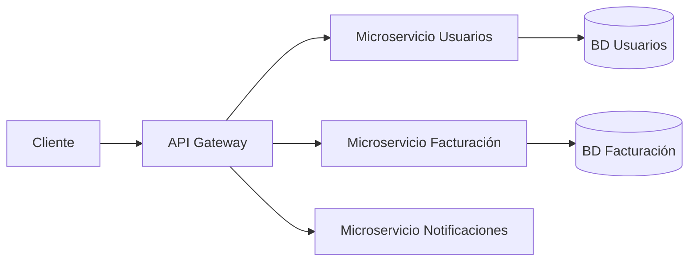

# Microservicios

## Tabla de contenido
- [¿Qué es?](#qué-es)
- [¿Para qué sirve?](#para-qué-sirve)
- [¿Cuándo utilizarlo?](#cuándo-utilizarlo)
- [Monolito vs. Microservicios](#monolito-vs-microservicios)
- [Ventajas](#ventajas)
- [Desventajas](#desventajas)
- [Microservicios + Clean Architecture](#microservicios--clean-architecture)
- [Recursos relacionados](#recursos-relacionados)

## ¿Qué es?

Una **arquitectura de microservicios** divide una aplicación en varios servicios pequeños, independientes y desplegables por separado, donde cada uno se encarga de una **responsabilidad de negocio concreta** (por ejemplo, un microservicio de Usuarios, otro de Facturación, otro de Notificaciones) y se comunica con los demás a través de la red (HTTP, mensajería, gRPC, etc.).

## ¿Para qué sirve?

- Permite que **cada equipo** desarrolle, despliegue y escale su servicio de forma independiente.
- Aísla fallos: si un microservicio cae, el resto de la aplicación puede seguir funcionando.
- Facilita usar **tecnologías distintas** por servicio según la necesidad (por ejemplo, un servicio en .NET y otro en Node.js).

## ¿Cuándo utilizarlo?

Conviene cuando:
- El equipo de desarrollo crece y varios equipos necesitan trabajar en paralelo sin bloquearse entre sí.
- Distintas partes del sistema tienen necesidades de escalamiento muy diferentes (por ejemplo, el módulo de reportes se usa poco, pero el de ventas recibe tráfico constante).

No conviene, o conviene empezar por un **monolito bien organizado**, cuando:
- El proyecto es pequeño, el equipo es reducido, o el dominio del negocio aún no está claro (dividir demasiado pronto suele generar más complejidad que valor).

## Monolito vs. Microservicios

| | Monolito | Microservicios |
|---|---|---|
| Despliegue | Una sola unidad | Independiente por servicio |
| Base de datos | Generalmente una sola | Una por servicio (idealmente) |
| Escalamiento | De toda la aplicación | Solo del servicio que lo necesita |
| Comunicación interna | Llamadas a métodos en memoria | Llamadas por red (HTTP, mensajería) |
| Complejidad operativa | Baja | Alta (orquestación, monitoreo, versionado) |

## Ventajas

- Escalamiento independiente por servicio.
- Despliegues más pequeños y frecuentes, con menor riesgo por release.
- Tolerancia a fallos: un servicio caído no tumba necesariamente a los demás.

## Desventajas

- Mayor complejidad operativa: hay que resolver comunicación entre servicios, consistencia de datos, monitoreo distribuido, etc.
- Las transacciones que abarcan varios servicios ya no son triviales (no hay una única base de datos ni un único `SaveChanges`).
- Requiere más infraestructura desde el día uno (contenedores, CI/CD por servicio, observabilidad).

> **Nota**
> Estos dos últimos puntos —comunicación entre servicios y consistencia de datos distribuida— se documentarán en detalle más adelante, en la fase de la ruta de aprendizaje dedicada a comunicación entre microservicios (proxies, mensajería) y patrones de consistencia (Sagas, Outbox).

## Microservicios + Clean Architecture

Ambos conceptos son independientes pero se complementan bien: **microservicios** define cómo se divide el sistema en servicios separados; **Clean Architecture** (ver [Clean Architecture](clean-architecture.md)) define cómo se organiza el código **dentro** de cada uno de esos servicios. Por eso cada microservicio de este proyecto (por ejemplo, `MicroservicioUsuarios`) tiene internamente sus propias capas `API`, `Application`, `Domain` e `Infrastructure`.

## Recursos relacionados

- [Clean Architecture](clean-architecture.md)
- [Estructura de carpetas por capa](estructura-carpetas.md)
- [Crear una solución de microservicios](../dotnet/crear-solucion-microservicios.md)

[⬅ Volver al índice de arquitectura](README.md)
