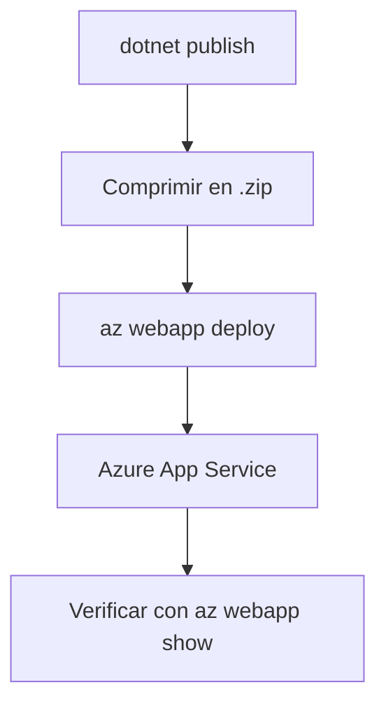
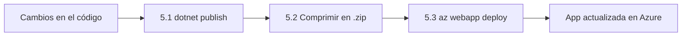

# Despliegue en Azure App Service

## Tabla de contenido
- [¿Qué es?](#qué-es)
- [¿Para qué sirve?](#para-qué-sirve)
- [¿Cuándo utilizarlo?](#cuándo-utilizarlo)
- [Paso 1 — Instalar herramientas necesarias](#paso-1--instalar-herramientas-necesarias)
- [Paso 2 — Iniciar sesión en Azure](#paso-2--iniciar-sesión-en-azure)
- [Paso 3 — Crear los recursos en Azure](#paso-3--crear-los-recursos-en-azure)
- [Paso 4 — Configurar el connection string](#paso-4--configurar-el-connection-string)
- [Paso 5 — Publicar el proyecto](#paso-5--publicar-el-proyecto)
- [Paso 6 — Verificar que funciona](#paso-6--verificar-que-funciona)
- [Flujo para futuras actualizaciones](#flujo-para-futuras-actualizaciones)
- [Ver logs en tiempo real](#ver-logs-en-tiempo-real)
- [Limpiar el App Service antes de redesplegar](#limpiar-el-app-service-antes-de-redesplegar)
- [Despliegue alternativo vía Kudu (zipdeploy)](#despliegue-alternativo-vía-kudu-zipdeploy)
- [Buenas prácticas](#buenas-prácticas)
- [Errores comunes](#errores-comunes)
- [Recursos relacionados](#recursos-relacionados)

## ¿Qué es?

**Azure App Service** es un servicio PaaS (Platform as a Service) de Microsoft Azure para alojar aplicaciones web y APIs sin necesidad de administrar servidores ni infraestructura subyacente.

## ¿Para qué sirve?

Permite desplegar un microservicio .NET publicado (ver [Publicar un microservicio](../dotnet/publicar-proyecto.md)) directamente desde un archivo `.zip`, usando **Azure CLI**, sin necesidad de configurar máquinas virtuales manualmente.

## ¿Cuándo utilizarlo?

- Cuando se necesita un entorno de hosting administrado, con escalado y monitoreo integrados.
- En proyectos que no requieren el control granular de una máquina virtual o un clúster de contenedores (para eso, considera **Azure Container Apps** o **AKS**).
- Es una buena opción para el **tier gratuito** en entornos de desarrollo, pruebas o demostraciones.



## Paso 1 — Instalar herramientas necesarias

1. **Azure CLI**
   - Descarga desde: https://aka.ms/installazurecliwindows
   - Verifica la instalación en tu terminal:
     ```bash
     az --version
     ```
2. **Extensión de Azure para VS Code**: `Azure App Service`.

## Paso 2 — Iniciar sesión en Azure

```bash
az login
```

Verificar la sesión activa:

```bash
az account show
```

## Paso 3 — Crear los recursos en Azure

### 3.1 — Crear un Resource Group

Un **Resource Group** actúa como contenedor lógico de todos los recursos relacionados con el proyecto:

```bash
az group create --name rg-sigesup --location brazilsouth
```

### 3.2 — Crear el App Service Plan

El plan define el servidor y el tier de facturación (aquí, tier gratuito):

```bash
az appservice plan create --name plan-sigesup --resource-group rg-sigesup --sku FREE --is-linux
```

### 3.3 — Crear la Web App

```bash
az webapp create --name sigesup-v1 --resource-group rg-sigesup --plan plan-sigesup --runtime "DOTNETCORE:10.0.101"
```

> **Nota**
> El valor de `--name` debe ser único a nivel global en Azure, ya que forma parte del subdominio `*.azurewebsites.net`. Ajusta el nombre del runtime (`DOTNETCORE:X.Y`) según la versión de .NET utilizada en tu proyecto.

## Paso 4 — Configurar el connection string

```bash
az webapp config connection-string set \
  --name sigesup-v1 \
  --resource-group rg-sigesup \
  --connection-string-type PostgreSQL \
  --settings ConnectionStrings__PGSQLConnection="Host=<TU_HOST_NEON>;Database=<TU_BASE_DE_DATOS>;Username=<TU_USUARIO>;Password=<TU_PASSWORD>;SSL Mode=VerifyFull;Channel Binding=Require;"
```

> **Advertencia**
> Nunca incluyas contraseñas o cadenas de conexión reales dentro de documentación, scripts versionados en Git o notas compartidas. Usa **Azure Key Vault** o las variables de configuración (`App Settings`) del propio App Service para almacenar estos valores de forma segura, y referencia esos secretos desde el pipeline de CI/CD en lugar de escribirlos en texto plano.

## Paso 5 — Publicar el proyecto

### 5.1 — Generar el paquete de publicación

Desde la raíz del proyecto:

```bash
dotnet publish -c Release -o ./publish
# o especificando el proyecto de la API directamente:
dotnet publish src/SIGESUP.API/SIGESUP.API.csproj -c Release -o ./publish
```

### 5.2 — Comprimir la carpeta `publish`

```bash
# PowerShell
Compress-Archive -Path ./publish/* -DestinationPath publish.zip

# bash/Linux
cd publish && zip -r ../publish.zip . && cd ..
```

> **Tip**
> Si necesitas recomprimir desde dentro de la propia carpeta `publish` (en lugar de un nivel arriba), usa:
> ```powershell
> Compress-Archive -Path .\* -DestinationPath ..\publish.zip -Force
> ```

### 5.3 — Subir el ZIP a Azure

**Windows:**
```bash
az webapp deploy --name sigesup-v1 --resource-group rg-sigesup --src-path publish.zip --type zip
```

**Linux / bash:**
```bash
az webapp deploy \
  --name sigesup-v1 \
  --resource-group rg-sigesup \
  --src-path publish.zip \
  --type zip \
  --async false
```

**Con limpieza y reinicio automático:**
```bash
az webapp deploy \
  --name sigesup-v1 \
  --resource-group rg-sigesup \
  --src-path publish.zip \
  --type zip \
  --clean true \
  --restart true
```

## Paso 6 — Verificar que funciona

```bash
az webapp show --name sigesup-v1 --resource-group rg-sigesup --query defaultHostName
```

Tu API estará disponible en una URL con el siguiente formato:

```text
https://mi-app-nombre-unico.azurewebsites.net
```

## Flujo para futuras actualizaciones

Cada vez que se realicen cambios en el código, basta con repetir los pasos **5.1 → 5.2 → 5.3**:



## Ver logs en tiempo real

Útil para diagnosticar errores luego de un despliegue:

```bash
az webapp log tail --name mi-app-nombre-unico --resource-group rg-mi-app
```

## Limpiar el App Service antes de redesplegar

En algunos casos (archivos corruptos, despliegues fallidos previos), es necesario limpiar manualmente el contenido de `wwwroot` mediante **Kudu** (el motor de gestión de despliegues de Azure App Service).

```bash
# 1. Detener la aplicación
az webapp stop --name sigesup-v1 --resource-group rg-sigesup

# 2. Limpiar el wwwroot vía la API de Kudu (VFS)
az rest --method DELETE \
  --url "https://sigesup-v1.scm.azurewebsites.net/api/vfs/site/wwwroot/?recursive=true" \
  --headers "Content-Type=application/json"

# 3. Volver a iniciar la aplicación
az webapp start --name sigesup-v1 --resource-group rg-sigesup
```

## Despliegue alternativo vía Kudu (zipdeploy)

Como alternativa a `az webapp deploy`, es posible subir el `.zip` directamente al endpoint de **Kudu zipdeploy** usando `curl`, autenticándose con las credenciales de despliegue (*deployment credentials*) del App Service:

```bash
curl.exe -X POST -u "<USUARIO_DE_DESPLIEGUE>:<PASSWORD_DE_DESPLIEGUE>" \
  --data-binary "@publish.zip" \
  https://sigesup-v1.scm.azurewebsites.net/api/zipdeploy
```

> **Advertencia**
> Las credenciales de despliegue (`<USUARIO_DE_DESPLIEGUE>` / `<PASSWORD_DE_DESPLIEGUE>`) son secretos sensibles y **nunca deben quedar escritos en texto plano** en un archivo versionado. Puedes obtenerlas de forma segura con:
> ```bash
> az webapp deployment list-publishing-credentials --name sigesup-v1 --resource-group rg-sigesup
> ```
> y almacenarlas como *secrets* en tu pipeline de CI/CD (por ejemplo, GitHub Actions o Azure DevOps) en lugar de pegarlas directamente en la terminal o en documentación.

## Buenas prácticas

- Usa nombres de recursos consistentes con un prefijo por proyecto (`rg-`, `plan-`, etc.) para facilitar la gestión cuando existan múltiples entornos (dev, staging, producción).
- Automatiza los pasos 5.1 a 5.3 en un pipeline de **GitHub Actions** o **Azure DevOps** en lugar de ejecutarlos manualmente en cada actualización.
- Revisa siempre los logs (`az webapp log tail`) inmediatamente después de cada despliegue para detectar errores de arranque.
- Guarda todas las credenciales (connection strings, contraseñas de despliegue) en **Azure Key Vault** o en las **App Settings** del recurso, nunca en el repositorio de código.

## Errores comunes

- ❌ Comprimir la carpeta `publish` en lugar de su contenido, generando una subcarpeta extra dentro del `.zip` que impide que la app arranque correctamente.
- ❌ Usar un `--name` de Web App que ya está en uso por otra cuenta de Azure (el nombre debe ser único a nivel global).
- ❌ Dejar cadenas de conexión o contraseñas de despliegue hardcodeadas en scripts o documentación compartida.
- ❌ No detener la aplicación (`az webapp stop`) antes de una limpieza manual del `wwwroot`, lo que puede causar comportamientos inesperados durante el despliegue.

## Recursos relacionados

- [Publicar un microservicio](../dotnet/publicar-proyecto.md)
- [Entity Framework Core: migraciones](../dotnet/entity-framework-migraciones.md)

[⬅ Volver al índice de Azure](README.md)
